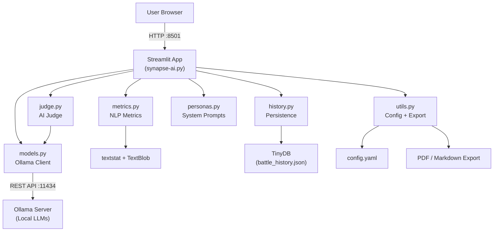

# ⚔️ Synapse AI Arena


**Synapse AI Arena** is a local, privacy-first AI model benchmarking platform. It allows users to pit multiple Large Language Models (LLMs) against each other in head-to-head "battles," evaluated by an impartial LLM judge. Everything runs entirely on your local machine using [Ollama](https://ollama.com/), meaning zero data leaves your environment.

---

## 🎯 Motivation

With the rapid proliferation of open-source LLMs (LLaMA, Mistral, Gemma, Phi, Qwen, etc.), deciding which model works best for a specific use-case or prompt is exceedingly difficult. Cloud-based leaderboards lack privacy and limit customization.

**Synapse AI Arena solves this by:**
- Keeping all data strictly local.
- Testing domain-specific knowledge using custom personas and prompts.
- Using a combination of **qualitative AI judging** and **quantitative NLP metrics** (readability, sentiment, speed).
- Generating a persistent, historical leaderboard specific to the models you use.

---

## ✨ Key Features

- ⚔️ **Head-to-head LLM Battles:** Run two local models in parallel to evaluate their responses side-by-side.
- 🔴 **Live Streaming Mode:** Real-time token streaming for live generation viewing.
- ⚖️ **Impartial AI Judge:** A dedicated, user-configured model (e.g., `qwen2.5`) scores responses on Accuracy, Completeness, Style, and Persona adherence.
- 📊 **Quantitative NLP Metrics:** Automatically compute Flesch Reading Ease, Flesch-Kincaid Grade Level, Polarity, Subjectivity, and response speed algorithms.
- 🎭 **Persona System:** 7 built-in personas (e.g., "Standard", "Angry Pirate", "5-Year-Old", "Philosopher") plus custom persona support to test alignment.
- 🏆 **Persistent Leaderboard:** Track win/loss/tie statistics over time to see which models consistently perform best.
- 📄 **Report Export:** Instantly export battle results to beautifully formatted Markdown or PDF files.
- 🐳 **Docker Deployment:** Fully containerized setup via `docker-compose` for isolated, reproducible deployments.

---

## 🏗️ Architecture



The system embraces a highly decoupled, modular design separating the Streamlit UI from the LLM execution layer, AI judgment, and database persistence.

---

## 🚀 Installation & Usage

### Option 1: Docker (Recommended)

The easiest way to run the application and an Ollama instance securely in isolated containers.

1. Clone the repository:
   ```bash
   git clone https://github.com/yourusername/synapse-ai-arena.git
   cd synapse-ai-arena
   ```
2. Run via Docker Compose:
   *(Note: Ensure Docker is running. The docker-compose can be configured for NVIDIA GPU passthrough by uncommenting the relevant lines).*
   ```bash
   docker-compose up --build
   ```
3. Open `http://localhost:8501` in your browser.

### Option 2: Local Python Environment

1. Ensure **[Ollama](https://ollama.com/)** is installed and running on your host machine (`http://127.0.0.1:11434`).
2. Pull some models to test in your terminal:
   ```bash
   ollama pull llama3
   ollama pull mistral
   ollama pull qwen2.5
   ```
3. Set up the Python environment:
   ```bash
   python -m venv venv
   source venv/bin/activate  # On Windows: venv\Scripts\activate
   pip install -r requirements.txt
   ```
4. Run the Streamlit application:
   ```bash
   streamlit run synapse-ai.py
   ```

---

## ⚙️ Configuration (`config.yaml`)

You can customize the core behavior of the application by editing `config.yaml`:

```yaml
app:
  title: "Synapse AI Arena"
ollama:
  host: "http://localhost:11434"
judge:
  model: "qwen2.5" # The model used to adjudicate battles (excluded from the competitor list)
defaults:
  temperature: 0.7
  top_p: 0.9
  context_length: 2048
history:
  db_path: "battle_history.json"
```

---

## 🗂️ Project Structure

- `synapse-ai.py`: The main Streamlit web application.
- `models.py`: Handles Ollie client interactions (listing models, API chat/stream generation, parallel battle execution).
- `judge.py`: Meta-prompting logic for the LLM-as-a-judge system.
- `metrics.py`: Computes NLP characteristics (Flesch score, Word count, Sentiment).
- `personas.py`: Pre-configured system prompts defining specific behaviors.
- `history.py`: Built using TinyDB to handle lightweight, zero-configuration local database persistence.
- `utils.py`: Utilities for configurations and PDF/Markdown file export.
- `tests/`: Extensive `pytest` suite simulating and mocking core modules (models, judge, metrics).

---

## 🧪 Testing

The repository relies on `pytest` combined with `pytest-mock` for unit testing the logic behind API connections, metrics algorithms, and database queries. 

To run the test suite:
```bash
pytest
```

---

## 📜 License & Privacy Context

**100% Privacy Focused:** Because Synapse AI Arena relies entirely on an active local installation of Ollama, your data, prompts, and output never leave your network. Period. 

*License:* MIT License
