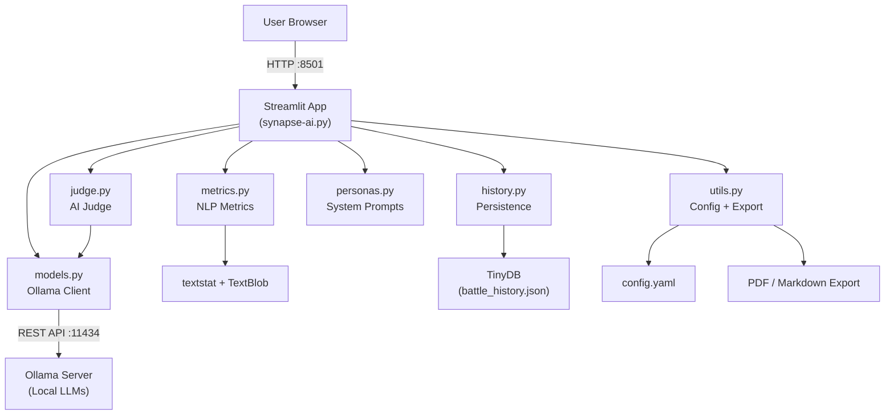
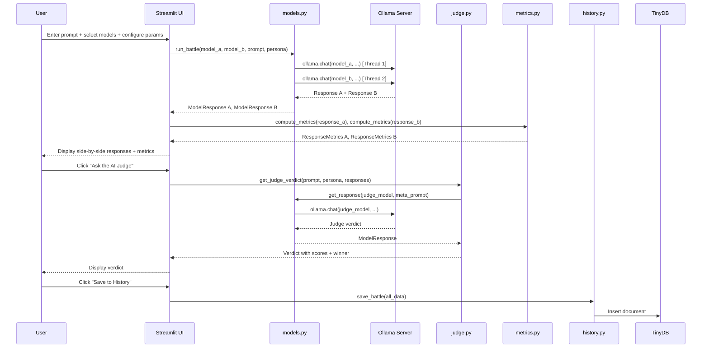

# Synapse AI Arena — Complete Project Information for Report

---

## 1. Project Title & Overview

**Title:** Synapse AI Arena

**One-liner:** A local, privacy-first AI model benchmarking platform that lets users pit multiple Large Language Models (LLMs) against each other in head-to-head "battles," evaluated by an impartial AI judge.

**Core Idea:** The application runs entirely on the user's machine via [Ollama](https://ollama.com/) (a local LLM inference engine). Users enter a prompt, select two models, and the system generates responses from both in parallel. An independent third "judge" model scores the outputs on multiple criteria and declares a winner. All results are persisted in a leaderboard.

---

## 2. Problem Statement / Motivation

With the rapid proliferation of open-source LLMs (LLaMA, Mistral, Gemma, Phi, Qwen, etc.), users face a **model selection problem** — which model is best for a given task? Cloud-based leaderboards (e.g., LMMSYS Chatbot Arena) require sending data to external servers and offer no customization.

**Synapse AI Arena solves this by:**
- Running everything **locally** — no data leaves the machine.
- Allowing **custom personas and prompts** for domain-specific evaluation.
- Providing **quantitative NLP metrics** alongside qualitative AI judging.
- Maintaining a **persistent leaderboard** to track model performance over time.

---

## 3. Objectives

| # | Objective |
|---|-----------|
| 1 | Enable side-by-side comparison of locally-hosted LLMs on user-defined prompts. |
| 2 | Automate quality evaluation using a dedicated AI judge model. |
| 3 | Compute quantitative NLP metrics (readability, sentiment) for each response. |
| 4 | Persist battle history and build a cumulative model leaderboard. |
| 5 | Support configurable personas to test models under different behavioral constraints. |
| 6 | Allow export of battle reports in Markdown and PDF formats. |
| 7 | Provide a fully containerized (Docker) deployment for reproducibility. |

---

## 4. Technology Stack

| Layer | Technology | Purpose |
|-------|-----------|---------|
| **Frontend / UI** | Streamlit ≥ 1.53 | Interactive web dashboard with tabs, sidebars, charts |
| **LLM Backend** | Ollama ≥ 0.4 (local) | Serves and runs LLMs locally (no cloud API needed) |
| **LLM Client** | `ollama` Python SDK | Communicates with the Ollama server via its REST API |
| **NLP Metrics** | `textstat` ≥ 0.7 | Flesch Reading Ease, Flesch-Kincaid Grade Level |
| **Sentiment Analysis** | `textblob` ≥ 0.18 | Polarity and subjectivity scoring |
| **Configuration** | PyYAML ≥ 6.0 | YAML-based config file (`config.yaml`) |
| **Data Persistence** | TinyDB ≥ 4.8 | Lightweight JSON-based document database |
| **Data Processing** | Pandas ≥ 2.3 | Leaderboard table rendering and data manipulation |
| **PDF Export** | fpdf2 ≥ 2.8 | Generates downloadable PDF battle reports |
| **Containerization** | Docker + Docker Compose | One-command deployment with GPU support option |
| **Testing** | pytest ≥ 8.0 + pytest-mock ≥ 3.14 | Unit testing with mocking |
| **Language** | Python 3.12 | Core programming language |

---

## 5. System Architecture



---

## 6. Module-by-Module Breakdown

### 6.1 `synapse-ai.py` — Main Application (404 lines)

The central Streamlit application. Structures the UI into **three tabs**:

| Tab | Functionality |
|-----|--------------|
| **🏟️ Arena** | Prompt input, model selection, battle execution (parallel or streaming), metrics display, AI judge invocation, save & export |
| **🏆 Leaderboard** | Aggregated win/loss/tie statistics with bar charts |
| **📜 History** | Chronological list of all past battles with expandable details |

**Key features in this file:**
- **Sidebar configuration**: Model selection, persona picker, temperature / top_p / context-length sliders, streaming toggle
- **Ollama health check**: Blocks the app if the Ollama backend is unreachable
- **Judge model filtering**: The dedicated judge model (e.g., `qwen2.5`) is automatically excluded from the competitor model list to prevent bias
- **Session state management**: Persists responses, times, verdicts across Streamlit reruns

---

### 6.2 `models.py` — LLM Interaction Layer (138 lines)

Handles all communication with the Ollama backend.

| Function | Description |
|----------|-------------|
| `list_available_models()` | Queries Ollama for locally-pulled models; falls back to a configured list |
| `check_ollama_health()` | Verifies the Ollama server is reachable |
| `get_response()` | Sends a prompt (with system prompt) to a model and returns the full response |
| `stream_response()` | Generator that yields `(token_chunk, elapsed)` tuples for live streaming |
| `run_battle()` | Runs two models **in parallel** using `ThreadPoolExecutor(max_workers=2)` |

**Data class:** `ModelResponse` — stores `model`, `content`, `elapsed`, `error`, `token_count`.

**Design decisions:**
- Parallel execution via Python's `concurrent.futures` for fair timing comparison
- Streaming uses Ollama's native streaming API for real-time token display

---

### 6.3 `judge.py` — AI Judge Module (75 lines)

Implements an **LLM-as-a-Judge** pattern using a structured meta-prompt.

**Evaluation Criteria (scored 1–10):**
1. **Accuracy** — factual correctness
2. **Completeness** — thoroughness of the answer
3. **Style** — writing quality and clarity
4. **Persona Adherence** — how well the response matches the assigned persona

**Output format:** The judge produces a formatted table of scores, a WINNER declaration, and a 2–3 sentence reasoning.

**Judge model:** Configurable via `config.yaml` (default: `qwen2.5`). Deliberately excluded from competition to maintain impartiality.

---

### 6.4 `metrics.py` — NLP Quality Metrics (57 lines)

Computes quantitative response quality metrics using established NLP libraries.

| Metric | Library | Range / Description |
|--------|---------|-------------------|
| Word Count | Built-in | Number of words |
| Character Count | Built-in | Total characters |
| Sentence Count | textstat | Number of sentences |
| Flesch Reading Ease | textstat | 0–100 (higher = easier to read) |
| Flesch-Kincaid Grade Level | textstat | US school grade level needed to understand |
| Sentiment Polarity | TextBlob | −1 (negative) to +1 (positive) |
| Sentiment Subjectivity | TextBlob | 0 (objective) to 1 (subjective) |

**Data class:** `ResponseMetrics` — typed container for all metric values.

---

### 6.5 `personas.py` — Persona System (49 lines)

Defines **7 built-in personas** + a custom persona option:

| Persona | System Prompt Summary |
|---------|----------------------|
| Standard Assistant | Helpful and precise AI assistant |
| Angry Pirate | 1700s pirate captain, aggressive but helpful |
| 5-Year-Old | Explains everything in simple terms, analogies |
| Philosopher | Deep thinker, includes philosopher quotes |
| Roast Master | Comedian who roasts the user while answering |
| Scientist | Data-driven, cites studies, technical language |
| Poet | Answers in rhyming verse / couplets |
| ✏️ Custom Persona | User-defined free-text system prompt |

**Purpose:** Personas let users evaluate how well models follow behavioral instructions — a key dimension of LLM capability.

---

### 6.6 `history.py` — Persistence & Leaderboard (96 lines)

Uses **TinyDB** (a lightweight JSON document database) for zero-configuration storage.

| Function | Description |
|----------|-------------|
| `save_battle()` | Inserts a battle record with timestamp, prompt, persona, both responses, times, winner, and judge verdict |
| `get_all_battles()` | Returns all records sorted newest-first |
| `get_leaderboard()` | Aggregates win/loss/tie/battle counts per model |
| `clear_history()` | Truncates the database |

**Storage file:** `battle_history.json` (configurable, max 500 records by default).

---

### 6.7 `utils.py` — Configuration & Export (150 lines)

| Component | Description |
|-----------|-------------|
| **Config loader** | Loads `config.yaml` with caching; supports dot-notation lookup (e.g., `cfg("ollama.host")`) |
| **Markdown export** | Generates a formatted Markdown battle report |
| **PDF export** | Generates a PDF report using `fpdf2` with proper formatting, headings, and multi-cell text layout |

---

### 6.8 `config.yaml` — Central Configuration (31 lines)

```yaml
app:          # Page title, layout
ollama:       # Host URL, fallback model list
judge:        # Judge model name, system prompt
defaults:     # Temperature (0.7), Top-P (0.9), Context length (2048)
history:      # Database path, max records (500)
```

---

## 7. Data Flow



---

## 8. Key Features Summary

### 8.1 Core Features
- ⚔️ **Head-to-head model battles** with parallel execution
- 🔴 **Live streaming mode** with real-time token display
- ⚖️ **AI Judge** with structured multi-criteria scoring (Accuracy, Completeness, Style, Persona)
- 📊 **Quantitative NLP metrics** (readability, sentiment, word count)
- 🎭 **7 built-in personas** + custom persona support
- 🏆 **Persistent leaderboard** with win rates and bar charts
- 📜 **Battle history** with expandable detail view
- 📄 **Export** to Markdown and PDF
- ⚡ **Speed comparison** — highlights the faster model

### 8.2 Architecture Qualities
- 🔒 **Privacy-first** — all processing is local, no data sent externally
- 🐳 **Docker-ready** — one-command deployment with `docker compose up --build`
- 🎛️ **Highly configurable** — YAML config for all parameters
- 🧪 **Tested** — unit tests with mocking for all core modules
- 📦 **Modular** — clean separation (models, judge, metrics, personas, history, utils)

---

## 9. Deployment & Containerization

### Dockerfile
- Base image: `python:3.12-slim`
- Installs dependencies from `requirements.txt`
- Downloads TextBlob corpora at build time
- Exposes port `8501` (Streamlit default)
- Includes a health check endpoint

### Docker Compose
Two services orchestrated together:

| Service | Image | Port | Notes |
|---------|-------|------|-------|
| `ollama` | `ollama/ollama:latest` | 11434 | LLM inference server, persistent volume for model weights |
| `arena` | Custom build (Dockerfile) | 8501 | Streamlit app, depends on `ollama` service |

- Optional **NVIDIA GPU passthrough** (commented-out config included)
- Battle history persisted via volume mount

---

## 10. Testing

**Framework:** pytest with pytest-mock

| Test File | Tests | What It Covers |
|-----------|-------|---------------|
| `test_models.py` | 7 tests | Model listing, health check, response generation, parallel battle, streaming |
| `test_judge.py` | 2 tests | Judge verdict generation, context passing to the judge model |
| `test_metrics.py` | 5 tests | Word count, reading ease, sentiment fields, token fallback/override |

**Testing approach:** All Ollama API calls are mocked using `unittest.mock.patch`, making tests runnable without a live Ollama server.

---

## 11. File Structure Summary

```
Synapse_AI_Arena/
├── synapse-ai.py          # Main Streamlit app (404 lines)
├── models.py              # Ollama interaction layer (138 lines)
├── judge.py               # AI Judge module (75 lines)
├── metrics.py             # NLP quality metrics (57 lines)
├── personas.py            # Persona definitions (49 lines)
├── history.py             # Battle persistence & leaderboard (96 lines)
├── utils.py               # Config loader + export (150 lines)
├── config.yaml            # Central YAML configuration (31 lines)
├── requirements.txt       # Python dependencies (13 packages)
├── Dockerfile             # Container image definition
├── docker-compose.yml     # Multi-service orchestration
├── pytest.ini             # Test configuration
├── battle_history.json    # TinyDB data file (auto-generated)
├── .gitignore
└── tests/
    ├── __init__.py
    ├── test_models.py     # 7 unit tests
    ├── test_judge.py      # 2 unit tests
    └── test_metrics.py    # 5 unit tests
```

**Total codebase:** ~969 lines of application code + ~202 lines of tests = **~1,171 lines**

---

## 12. Suggested Report Sections

If writing an academic/project report, here's a suggested structure:

1. **Abstract** — Brief summary of the project and its contributions
2. **Introduction** — Problem statement, motivation, objectives
3. **Literature Review / Related Work** — Chatbot Arena (LMMSYS), LLM evaluation methods, readability metrics
4. **System Design & Architecture** — Use the architecture diagram and data flow from above
5. **Implementation** — Module-by-module breakdown, technology choices, key algorithms
6. **Personas & Evaluation Criteria** — How the system tests different model behaviors
7. **Results & Discussion** — Show sample battles from `battle_history.json`, leaderboard data
8. **Deployment** — Docker containerization, local setup instructions
9. **Testing** — Unit test coverage and methodology
10. **Future Scope** — Multi-turn conversations, ELO rating system, more metrics, cloud deployment
11. **Conclusion**
12. **References**

---

## 13. Potential Future Scope (for report)

- **ELO / TrueSkill rating system** for more statistically robust rankings
- **Multi-turn conversation battles** (not just single-prompt)
- **Blind/anonymous battles** where the user votes before revealing model names
- **Additional metrics**: BLEU, ROUGE, BERTScore for reference-based evaluation
- **Multi-modal support**: image generation model comparison
- **Web deployment**: hosting on cloud with authentication
- **Comparative visualization**: radar charts, response-diff highlighting
